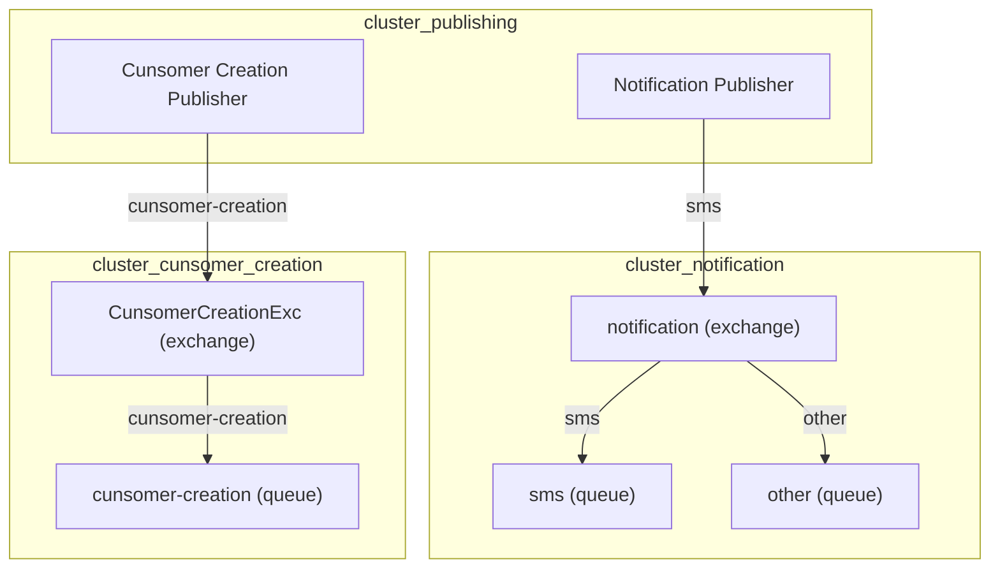

# Publisher example

diagram exchange, routeKey and queue

```mermaid
graph TD
  subgraph cluster_notification
    exchange_notification["notification (exchange)"]
    queue_sms["sms (queue)"]
    queue_other["other (queue)"]
    exchange_notification -- sms --> queue_sms
    exchange_notification -- other --> queue_other
  end

  subgraph cluster_cunsomer_creation
    exchange_cunsomer_creation["CunsomerCreationExc (exchange)"]
    queue_cunsomer_creation["cunsomer-creation (queue)"]
    exchange_cunsomer_creation -- cunsomer-creation --> queue_cunsomer_creation
  end

  subgraph cluster_publishing
    cunsomer_creation_publisher["Cunsomer Creation Publisher"]
    notification_publisher["Notification Publisher"]
    cunsomer_creation_publisher -- cunsomer-creation --> exchange_cunsomer_creation
    notification_publisher -- sms --> exchange_notification
  end
```